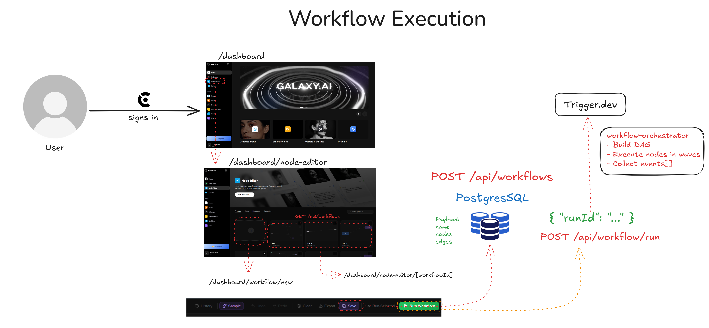
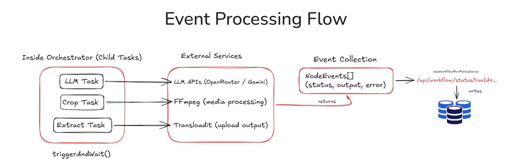
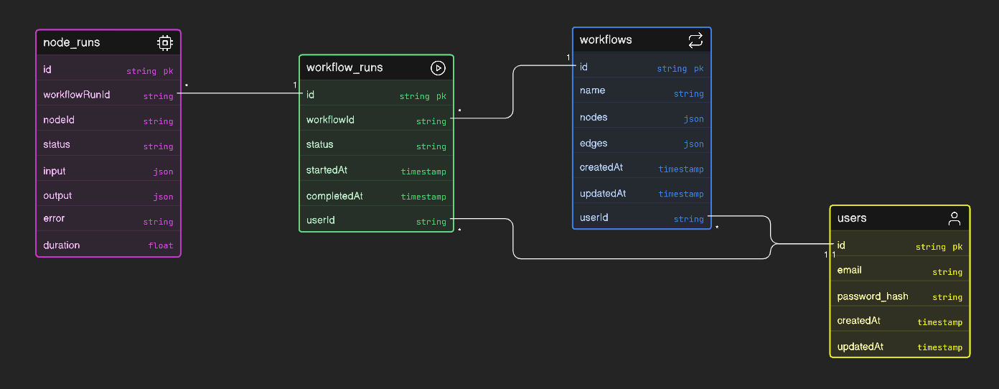
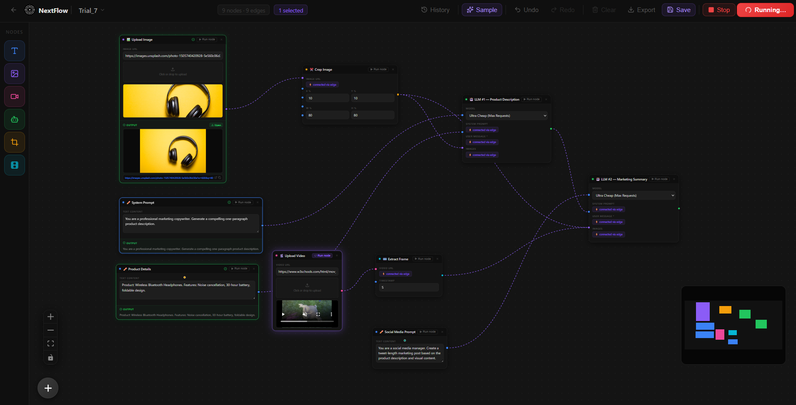

# NextFlow — AI Workflow Builder

NextFlow is a visual, node-based workflow builder for designing and executing AI-powered pipelines.
It enables users to combine LLMs, image processing, and video transformations into workflows that are executed asynchronously with detailed execution tracking.

---

## High-Level Architecture

### 1. Workflow Trigger & User Flow

<p align="center">
  
</p>

This flow represents how users interact with the system:

* Users authenticate via Clerk and access the dashboard
* Workflows are created and edited in the node editor (React Flow)
* Workflows are saved via API routes to PostgreSQL (Prisma)
* Execution is triggered through an API call, returning a `runId` immediately
* The system follows a non-blocking, serverless-compatible trigger pattern

---

### 2. Execution & Event Processing Flow

<p align="center">
  
</p>

This flow represents the backend execution system:

* A Trigger.dev orchestrator task executes the workflow as a DAG
* Nodes are processed in dependency order (parallel where possible)
* Specialized tasks are delegated:

  * LLM → OpenRouter / Gemini
  * Media (crop/extract) → FFmpeg
  * Outputs → Transloadit (CDN storage)
* Execution events are collected as `NodeEvents[]`
* Events are returned after completion and replayed on the frontend
# NextFlow — AI Workflow Builder

NextFlow is a visual, node-based workflow builder for designing and executing AI-powered pipelines.
It enables users to combine LLMs, image processing, and video transformations into workflows that are executed asynchronously with detailed execution tracking.

---

## High-Level Architecture

### 1. Workflow Trigger & User Flow

<p align="center">
  
</p>

This flow represents how users interact with the system:

* Users authenticate via Clerk and access the dashboard
* Workflows are created and edited in the node editor (React Flow)
* Workflows are saved via API routes to PostgreSQL (Prisma)
* Execution is triggered through an API call, returning a `runId` immediately
* The system follows a non-blocking, serverless-compatible trigger pattern

---

### 2. Execution & Event Processing Flow

<p align="center">
  
</p>

This flow represents the backend execution system:

* A Trigger.dev orchestrator task executes the workflow as a DAG
* Nodes are processed in dependency order (parallel where possible)
* Specialized tasks are delegated:

  * LLM → OpenRouter / Gemini
  * Media (crop/extract) → FFmpeg
  * Outputs → Transloadit (CDN storage)
* Execution events are collected as `NodeEvents[]`
* Events are returned after completion and replayed on the frontend
* The frontend persists execution results into the database

---

## System Overview

```
Frontend (Next.js + React Flow + Zustand)
        ↓
API Layer (Next.js Route Handlers)
        ↓
Trigger.dev (Orchestrator + Child Tasks)
        ↓
External Services (LLM APIs, FFmpeg, Transloadit)
        ↓
Database (PostgreSQL via Prisma)
```

---

## Database ER Diagram

<p align="center">
  
</p>

---

## Data Model

### User

* Managed via Clerk authentication
* Owns multiple workflows

### Workflow

* id
* userId
* name
* nodes (JSON)
* edges (JSON)
* createdAt
* updatedAt

### WorkflowRun

* Represents a single execution instance
* id
* workflowId
* userId
* status (running | success | failed)
* startedAt
* completedAt

### NodeRun

* Tracks execution of each node
* id
* workflowRunId
* nodeId
* status
* input
* output
* error
* duration

---

## Workflow Execution Model
<p align="center">
  
</p>
1. A workflow is created visually using nodes and edges
2. The structure is stored as JSON in the database
3. On execution:

   * API triggers the orchestrator (`workflow-orchestrator`)
   * A `runId` is returned immediately
4. The orchestrator:

   * Builds a DAG using topological sorting
   * Executes nodes in waves
   * Delegates heavy operations to child tasks
5. All execution events are collected and returned after completion
6. The frontend:

   * Polls for execution status
   * Replays events to update UI
   * Persists results into the database

---

## Integrations

### AI & Processing

* OpenRouter / Gemini (LLM execution)
* FFmpeg (image and video processing)

### Infrastructure

* Transloadit (output upload and CDN URLs)
* Trigger.dev (asynchronous execution engine)

### Authentication

* Clerk

---

## Key Features

* Visual workflow builder using React Flow
* DAG-based execution with dependency resolution
* Parallel execution of independent nodes
* Asynchronous execution via Trigger.dev
* Polling-based UI updates (serverless-safe)
* Persistent execution history (WorkflowRun, NodeRun)

---

## Architecture Decisions

* **Trigger + Poll Pattern**

  Avoids long-running serverless requests and ensures scalability

* **Separation of Concerns**

  * Execution handled by Trigger.dev
  * Persistence handled by frontend
  * UI state managed via Zustand

* **JSON-Based Workflow Storage**
  Enables flexible and dynamic workflow definitions

* **Two-Level Task Architecture**
  Orchestrator (parent) + specialized child tasks (LLM, media)

* **Environment-Aware Execution**
  Handles differences between local (Windows) and production (Linux) environments

---

## Deployment

* Frontend deployed on Vercel
* Background tasks deployed via Trigger.dev
* Database hosted on Neon (PostgreSQL)

---

<p align="center">
  Built by <b>Mahesh Babu</b>
  
</p>